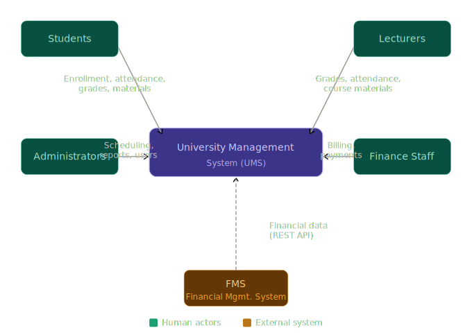

# Context and Scope

## Business Context

The University Management System receives and sends data from and to the following communication partners:

**University Management System**

| Communication Partner             | Input (received by UMS)                                             | Output (sent by UMS)                                                   |
|-----------------------------------|---------------------------------------------------------------------|------------------------------------------------------------------------|
| Students                          | Enrollment requests, attendance confirmations, payment submissions  | Course schedules, grades, transcripts, course materials, notifications |
| Lecturers                         | Attendance records, grade submissions, uploaded course materials    | Class lists, attendance summaries, grading confirmations               |
| Administrators                    | Scheduling inputs, user account management actions, report requests | Generated reports, scheduling confirmations, system alerts             |
| Finance Staff                     | Billing configurations, payment verifications                       | Invoices, payment confirmations, financial reports                     |
| Student Information System (SIS)  | Student master data, registration records                           | Updated enrollment status, course assignments                          |
| Financial Management System (FMS) | Financial transaction records, payment status updates               | Billing records, payment requests                                      |
| Email Service | Delivery status or errors | Student notifications |

All human actors interact with the system through a browser-based interface. No specialized client software is required. The SIS, FMS, and Email Service are external systems that the UMS integrates with through dedicated interfaces.

The internal modules responsible for these interactions are described in the [Building Block View](05_building_block_view.md). Relevant failure behavior for the FMS and Email Service is shown in the [Runtime View](06_runtime_view.md).

*Figure 3.1: Business Context of the University Management System*

## Technical Context

The UMS communicates with its environment through the following technical channels:

| Channel                | Technology                           | Protocol     | Description                                                                                                                               |
|------------------------|--------------------------------------|--------------|-------------------------------------------------------------------------------------------------------------------------------------------|
| User interface         | React frontend, standard web browser | HTTPS        | All human actors access the system through a browser. No client installation is required.                                                 |
| UMS ↔ SIS              | REST API                             | HTTPS        | The UMS exchanges student data with the existing Student Information System through a documented REST API.                                |
| UMS ↔ FMS              | REST API                             | HTTPS        | The UMS exchanges financial and billing data with the existing Financial Management System through a documented REST API.                 |
| UMS ↔ Email Service    | Email API or SMTP                    | HTTPS / SMTP | The UMS sends notifications to students through an external email service.                                                                |
| UMS backend ↔ database | MongoDB driver                       | Internal TCP | The Node.js backend communicates with the MongoDB database within the cloud infrastructure. The database is not exposed externally.       |
| Cloud infrastructure   | AWS                                  | —            | The application is deployed and hosted on AWS. All communication between components is secured within the cloud environment.              |

### Mapping of Inputs/Outputs to Channels

| Input / Output                                                     | Channel                                    | Protocol         | Notes                                                      |
|--------------------------------------------------------------------|--------------------------------------------|------------------|------------------------------------------------------------|
| All user interactions (students, lecturers, admins, finance staff) | Browser → React Frontend → Node.js Backend | HTTPS            | Encrypted in transit; accessible from any standard browser |
| Grade submissions, attendance records, enrollment requests         | User browser → Backend API                 | HTTPS / REST     | Authenticated via role-based access control                |
| Course materials, schedules, notifications                         | Backend → User browser                     | HTTPS / REST     | Served through the React frontend                          |
| Email notifications                                                | Backend → Email Service                    | HTTPS / SMTP     | Sent asynchronously after the related operation succeeds  |
| Student master data (read/write)                                   | Backend ↔ Student Information System       | HTTPS / REST API | Synchronized through a documented external API             |
| Billing and payment data (read/write)                              | Backend ↔ Financial Management System      | HTTPS / REST API | Synchronized through a documented external API             |
| Persistent application data (all modules)                          | Backend ↔ MongoDB                          | Internal TCP     | Database is not exposed outside the cloud environment      |

The physical placement of these elements is documented in the [Deployment View](07_deployment_view.md).

---

[← Previous: Architecture Constraints](02_architecture_constraints.md) | [Overview](README.md) | [Next: Solution Strategy →](04_solution_strategy.md)
