# Building Block View

## Level 1 — Overall System

### White-box: University Management System

The University Management System is decomposed into seven functional modules. Each module is responsible for a clearly defined business domain. All modules share the Authentication module for access control.

*Figure 5.1: Level 1 Building Block View of the University Management System*

#### Contained building blocks

| Building Block        | Responsibility                                                                           |
|-----------------------|------------------------------------------------------------------------------------------|
| Authentication        | Manages user login, session handling, and role-based access control for all user groups. |
| Course management     | Manages the course catalog, curriculum, and student enrollment into courses.             |
| Faculty management    | Manages lecturer profiles, teaching assignments, and department scheduling.              |
| Attendance management | Tracks and reports student attendance per course session.                                |
| Grades management     | Manages grade entry, GPA calculation, and transcript generation.                         |
| Student management    | Manages student profiles, personal records, and academic history.                        |
| Billing & payments    | Handles invoice generation, payment processing, and financial reporting for students.    |
| Reporting & analytics | Aggregates data from other modules to generate administrative and analytical reports.    |

#### Important interfaces

| Interface                             | Description                                                                                 |
|---------------------------------------|---------------------------------------------------------------------------------------------|
| Student → Student Management          | Students view and update their personal records and academic history.                       |
| Student → Course Management           | Students browse the course catalog and submit enrollment requests.                          |
| Lecturer → Attendance Management      | Lecturers record and review attendance for their courses.                                   |
| Lecturer → Grades Management          | Lecturers submit and manage grades for their students.                                      |
| Grades Management → Message Queue | Schedules student notifications after grades have been stored successfully. |
| Administrator → Faculty Management    | Administrators manage lecturer accounts and course assignments.                             |
| Administrator → Reporting & Analytics | Administrators request and export system-wide reports.                                      |
| Finance Staff → Billing & Payments    | Finance staff manage invoices and verify payment transactions.                              |
| Student Management ↔ SIS              | Student records are synchronized with the external Student Information System via REST API. |
| Billing & Payments ↔ FMS              | Financial data is synchronized with the external Financial Management System via REST API.  |

---

## Level 2 — Student Management

### White-box: Student Management module

The Student Management module follows a layered architecture, separating HTTP handling, business logic, and data access into distinct components. This structure is consistent across all other modules in the system.

*Figure 5.2: Level 2 Building Block View — Student Management module*

#### Contained building blocks

| Building Block    | Responsibility                                                                                                      |
|-------------------|---------------------------------------------------------------------------------------------------------------------|
| StudentController | Receives and validates incoming HTTP requests from the Student API. Delegates processing to the StudentService.     |
| StudentService    | Contains all business logic for student operations, including validation rules and coordination between components. |
| StudentRepository | Handles all database interactions. Translates between domain objects and queries against the MongoDB database.      |
| Student           | Domain model representing a student, including their id, name, and associated major.                                |
| Major             | Domain model representing an academic major with abbreviation, name, and description.                               |

#### Important interfaces

| Interface                          | Description                                                                              |
|------------------------------------|------------------------------------------------------------------------------------------|
| Student API → StudentController    | External REST API calls from the frontend or other modules enter through the controller. |
| StudentController → StudentService | The controller delegates all business operations to the service layer.                   |
| StudentService → StudentRepository | The service requests data reads and writes through the repository.                       |
| StudentRepository → MongoDB        | The repository communicates with the MongoDB database.                                   |

---

## Level 3 — StudentController, StudentService, StudentRepository

The internal structure of the Student Management module's three layers is documented in the class diagram below. Each layer exposes the same set of operations, enforcing a clean separation of concerns from HTTP handling down to data persistence.

*Figure 5.3: Level 3 Class Diagram — Student Management layers*

#### Exposed operations

| Operation                                          | Description                                                                                     |
|----------------------------------------------------|-------------------------------------------------------------------------------------------------|
| `ChangeStudentInformation(studentId, name, major)` | Updates the name and major of an existing student record. Returns a boolean indicating success. |
| `GetStudentInformation(personId)`                  | Retrieves the full Student object for a given person identifier.                                |
| `DeleteStudent(studentId)`                         | Removes a student record from the system. Returns a boolean indicating success.                 |