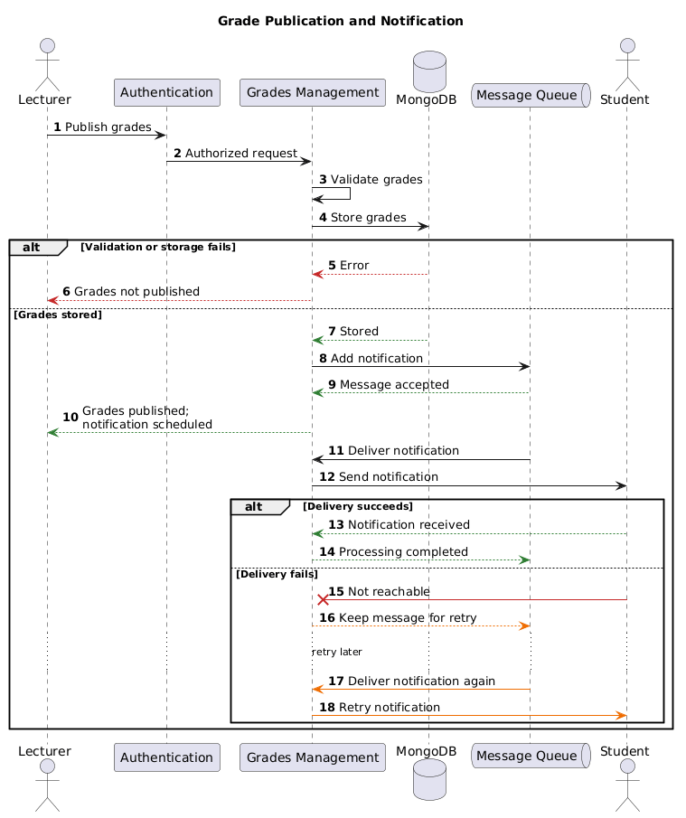
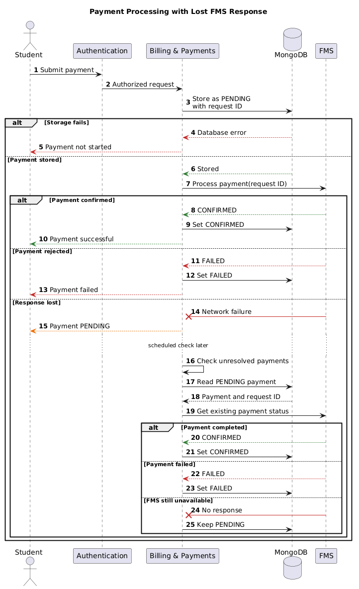

# Runtime View

This runtime view documents two failure scenarios that are important for the architecture:

1. a grade notification cannot be delivered immediately;
2. the result of a payment request is lost during communication with the external FMS.

The scenarios use building blocks from the [Building Block View](05_building_block_view.md). The Message Queue is a technical communication mechanism used for delayed notifications.

## Runtime Participants

| Runtime Participant | Mapping to [Section 5](05_building_block_view.md) | Responsibility |
|---|---|---|
| Authentication | Authentication | Verifies the identity, role, and permissions of the user |
| Grades Management | Grades management | Validates and stores grades, schedules notifications, and processes retries |
| Grades Collection | Collection in the shared MongoDB database | Stores grade records managed by Grades Management |
| Message Queue | Technical communication mechanism | Keeps notification messages until they can be processed |
| Email Service | External system connected to Grades Management | Delivers email notifications to students |
| Billing & Payments | Billing & payments | Creates payment requests, manages their status, and checks unresolved payments |
| Payments Collection | Collection in the shared MongoDB database | Stores payment records, request IDs, and status managed by Billing & Payments |
| FMS | External system connected through the Billing & Payments interface | Processes payments and returns their status |

The UMS uses one shared MongoDB database with separate collections for the functional modules. The collections follow the data ownership principle from [Section 8.4](08_concepts.md#84-data-persistence-and-consistency): grade data is managed by Grades Management and payment data by Billing & Payments. Other modules do not modify these collections directly.

## 6.1 Grade Notification Cannot Be Delivered

### Initial Situation

A lecturer publishes grades for a course. Grades Management stores the grades and schedules an email notification for the students.

The email connection may be unavailable after the grades have already been stored. Repeating the complete grade submission would be wrong because the grade data is already correct.

*Figure 6.1: Grade publication with delayed notification*

### Runtime Steps

1. `Authentication` verifies that the lecturer may publish grades for the course.
2. `Grades management` validates and stores the grades.
3. If storage fails, no notification is created and the lecturer receives an error.
4. After successful storage, `Grades management` adds a notification to the Message Queue.
5. The lecturer is informed that the grades were published and the notification was scheduled.
6. Grades Management processes the queued message and sends the notification through the external Email Service.
7. If the Email Service is unavailable, the message remains in the queue and Grades Management processes it again later.

### Architectural Decision

Grade storage and notification delivery are separated. Grades Management is responsible for the grade data and sends notifications through the external Email Service. The Message Queue ensures that a temporary email failure does not lose the notification.

The response to the lecturer means:

> The grades were stored and the notification was scheduled.

It does not mean that every student has already received an email.

### Expected Result

- A failed grade update creates no notification.
- Stored grades remain available if email delivery fails.
- The notification is retried without storing the grades again.
- A failure of the email connection does not block Grades Management.

---

## 6.2 Payment Result Is Unknown

### Initial Situation

A student starts a payment. Billing & Payments stores the operation and sends a request to the external Financial Management System.

The FMS may process the payment, but the network connection can fail before its response reaches the UMS. The UMS then does not know whether the payment succeeded.

*Figure 6.2: Payment processing with a lost FMS response*

### Runtime Steps

1. `Authentication` verifies the student.
2. `Billing & payments` stores the payment as `PENDING` with a unique request ID.
3. If the payment cannot be stored, the operation stops and no request is sent to the FMS.
4. After successful storage, the payment request is sent to the FMS.
5. A normal FMS response changes the status to `CONFIRMED` or `FAILED`.
6. If the response is lost, the payment remains `PENDING` and the student is informed that it is being verified.
7. Billing & Payments later asks the FMS for the status of the existing request.
8. Billing & Payments stores `CONFIRMED` or `FAILED`. If the FMS is still unavailable, it keeps `PENDING` and tries again later.
9. The student can request and view the current payment status.

### Architectural Decision and CAP

CAP is not the main concern between the internal modules of the modular monolith. It is relevant at the network boundary between the UMS and the independently deployed FMS.

During a network failure, the UMS cannot provide both an immediate final response and guaranteed correct payment information. Billing & Payments therefore prioritizes consistency:

- it does not display an unconfirmed payment as successful;
- it keeps the payment in a controlled `PENDING` state;
- it checks the existing payment later using the same request ID instead of creating a second payment.

### Expected Result

- An unknown payment result is never shown as successful.
- The payment is not submitted a second time.
- The student sees the clear temporary status `PENDING`.
- The result eventually becomes `CONFIRMED` or `FAILED`.
- If the FMS remains unavailable, the payment stays `PENDING` and is checked again later.

## Summary

| Scenario | Actual Risk | Responsible Building Block | Architectural Response |
|---|---|---|---|
| Grade notification | Grades are stored, but notification delivery fails | Grades management | Message Queue retains the notification for a later retry |
| Payment processing | The FMS response is lost and the payment result is unknown | Billing & payments | Store `PENDING` and retrieve the existing payment status later |

---

[← Previous: Building Block View](05_building_block_view.md) | [Overview](README.md) | [Next: Deployment View →](07_deployment_view.md)
