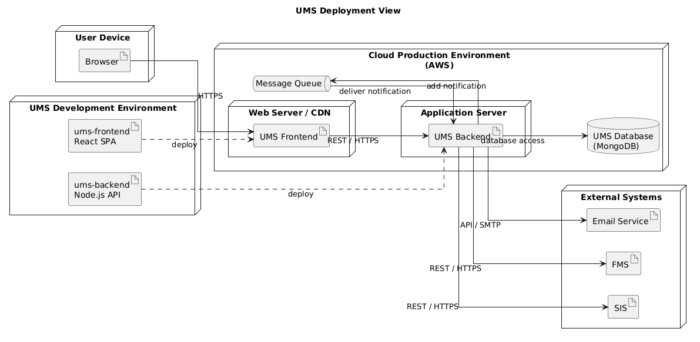

# Deployment View

## Infrastructure Level 1

### Overview Diagram

*Figure 7.1: Deployment View of the University Management System*

### Motivation

The University Management System is deployed as a cloud-hosted web application.

Users access the system through a standard web browser. The frontend is implemented using React and communicates with the backend through REST APIs. The backend is implemented using Node.js and contains the business logic for enrollment, attendance tracking, grading, billing, and reporting.

Persistent data is stored in a MongoDB database. Existing university systems such as the Student Information System (SIS) and the Financial Management System are integrated through dedicated APIs.

A Message Queue is used for asynchronous grade notifications. It stores notification messages until Grades Management can process them successfully.

The deployed elements implement the modules from the [Building Block View](05_building_block_view.md). The queue-based notification and FMS recovery flows are explained in the [Runtime View](06_runtime_view.md).

This deployment structure supports centralized data management, simple maintenance, and easy access for all user groups.

### Quality and/or Performance Features

* Web-based access without client installation.
* Centralized deployment simplifies maintenance and updates.
* Cloud infrastructure supports scalability for growing numbers of users.
* Separation between frontend, backend, and database improves maintainability.
* API-based integration enables reliable communication with external university systems.

### Mapping of Building Blocks to Infrastructure

This table maps the logical elements from [Section 5](05_building_block_view.md) to their physical runtime infrastructure.

| Building Block                   | Infrastructure Element      |
| -------------------------------- | --------------------------- |
| User Interface                   | React Web Client            |
| Authentication & Authorization   | Node.js Backend             |
| Student Management               | Node.js Backend             |
| Course Management                | Node.js Backend             |
| Attendance Management            | Node.js Backend             |
| Grades Management                | Node.js Backend             |
| Billing & Payment Management     | Node.js Backend             |
| Reporting & Analytics            | Node.js Backend             |
| Academic and Administrative Data | MongoDB Database            |
| Student Information Integration  | External SIS                |
| Financial Data Integration       | Financial Management System |
| Email Notification Delivery      | External Email Service      |
| Grade Notification Messages      | Cloud Message Queue         | 

## Infrastructure Level 2

### Application Server

The application server hosts the Node.js backend and provides the business functionality of the system.

Responsibilities:

* authentication and authorization
* enrollment processing
* attendance tracking
* grade management
* billing workflows
* reporting and analytics
* communication with external systems
* processing queued grade notifications
* checking unresolved payment states with the FMS

### Database Server

The MongoDB database stores all persistent application data.

Stored information includes:

* student records
* course information
* enrollments
* attendance records
* grades and transcripts
* billing information
* reporting data

The database is only accessed through the backend services and is not directly exposed to users.

---

[← Previous: Runtime View](06_runtime_view.md) | [Overview](README.md) | [Next: Cross-cutting Concepts →](08_concepts.md)
