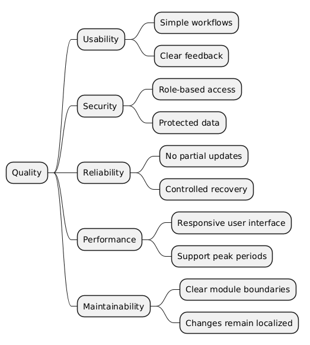

# Quality Requirements

This section makes the quality goals from Section 1 more concrete.

The three prioritized quality goals of the University Management System are:

1. Usability
2. Security
3. Reliability

Performance and maintainability are included in the quality tree as lower-priority attributes because they are already addressed by the cloud deployment and modular monolith.

## 10.1 Quality Requirements Overview

### Quality Tree

| Priority | Quality Requirement | Description |
|---|---|---|
| 1 | Usability | The system should be easy to understand and use for students, lecturers, administrators, and finance staff. Common workflows include course enrollment, attendance tracking, grade submission, access to course materials, reporting, and payment processing. |
| 2 | Security | Personal student data, grades, attendance records, and financial information must only be accessible to authorized users. Access is controlled through authentication and role-based authorization. |
| 3 | Reliability | Important operations such as enrollment, grade publication, attendance tracking, and payment processing must complete correctly or fail in a controlled way without losing or corrupting data. |
| 4 | Performance | The browser-based system should remain responsive during normal use and important peak periods such as enrollment. |
| 5 | Maintainability | Changes should remain within the responsible module whenever possible. |

## 10.2 Quality Scenarios

The following scenarios are based on the quality goals from Section 1 and on the architectural behavior already described in Sections 6 and 8.

### QS-1: Course Enrollment

| Field | Description |
|---|---|
| Scenario ID | QS-1 |
| Scenario Name | Course Enrollment |
| Source | Student |
| Stimulus | The student selects an available course and submits an enrollment request. |
| Environment | Normal operation using the browser-based UMS. |
| Artifact | React Frontend, Authentication, Course management |
| Response | The system shows the course information, checks the enrollment requirements, processes the request, and displays either a confirmation or a clear reason for rejection. |
| Response Measure | After login, the student can complete the enrollment in no more than five user actions without external tools such as spreadsheets or email. The system always displays either a confirmation or a reason for rejection. |

### QS-2: Unauthorized Access to Grades

| Field | Description |
|---|---|
| Scenario ID | QS-2 |
| Scenario Name | Unauthorized Access to Grades |
| Source | Student or lecturer without the required permission |
| Stimulus | A student requests another student's grades, or a lecturer attempts to modify grades for a course they are not assigned to. |
| Environment | Normal operation with the user logged in to the UMS. |
| Artifact | Authentication, Grades management, Grades Collection |
| Response | Authentication and Grades Management reject the request before protected data is returned or modified. The rejected request is logged. |
| Response Measure | Unauthorized requests must return HTTP 403. No protected grade data may be included in the response and no grade record may be modified. |

### QS-3: Failure During Grade Publication

| Field | Description |
|---|---|
| Scenario ID | QS-3 |
| Scenario Name | Failure During Grade Publication |
| Source | Lecturer or technical failure |
| Stimulus | The lecturer publishes grades, but the grade data cannot be stored or the student notification cannot be delivered. |
| Environment | Grade publication during normal system operation. |
| Artifact | Grades management, Grades Collection, Message Queue, Email Service |
| Response | If grade storage fails, the grades are not published and no notification is created. If storage succeeds but the Email Service cannot deliver the notification, the grades remain stored and the notification stays in the Message Queue for a later retry. |
| Response Measure | A failed storage operation leaves no partial grade update. A notification is scheduled only after successful grade storage. If delivery fails, the message remains in the queue and is available for the next retry. |

### QS-4: Lost FMS Response

| Field | Description |
|---|---|
| Scenario ID | QS-4 |
| Scenario Name | Lost FMS Response |
| Source | Network failure between the UMS and the FMS |
| Stimulus | The network connection fails after Billing & Payments sends the payment request but before the FMS response reaches the UMS. |
| Environment | Payment processing during normal system operation. |
| Artifact | Billing & payments, Payments Collection, FMS |
| Response | The payment remains `PENDING`. The UMS does not send the payment again. Billing & Payments later requests the status of the existing payment using its request ID. |
| Response Measure | An unconfirmed payment is not displayed as successful. A lost response does not create a second payment. The status remains `PENDING` until the FMS returns `CONFIRMED` or `FAILED`. |
